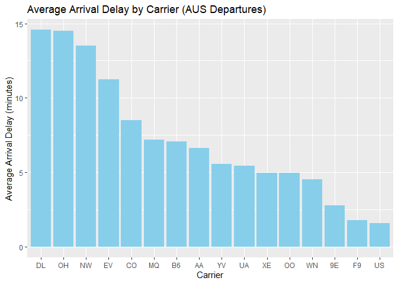
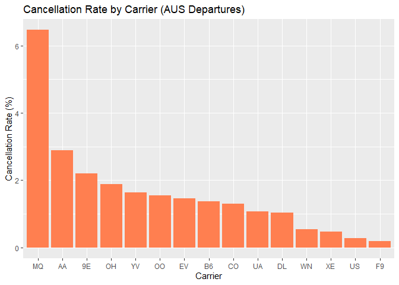
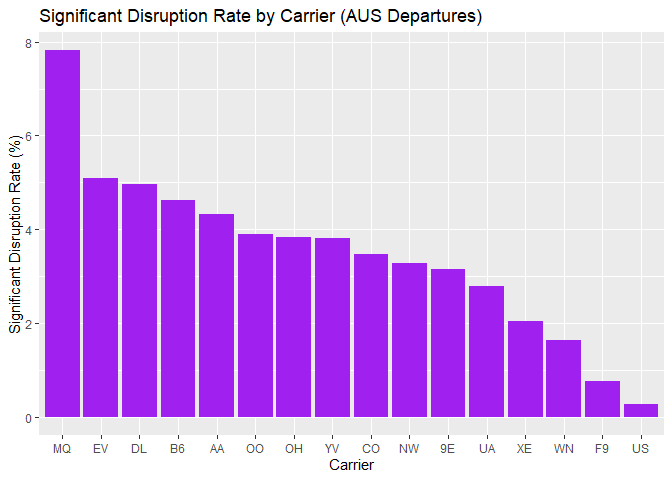
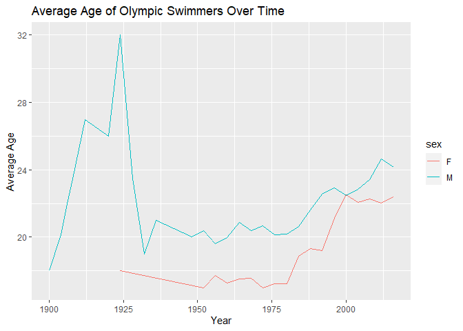
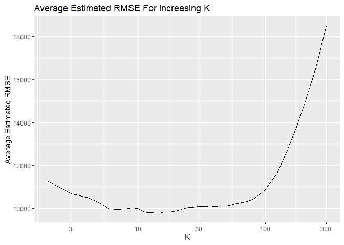
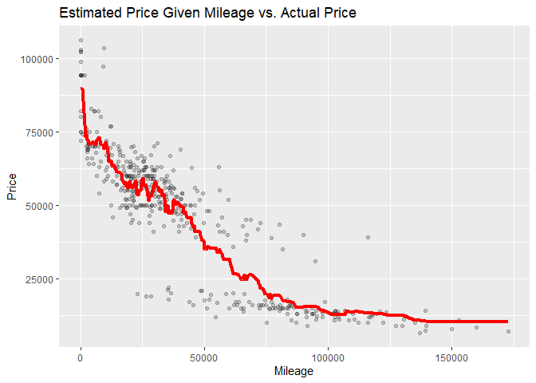
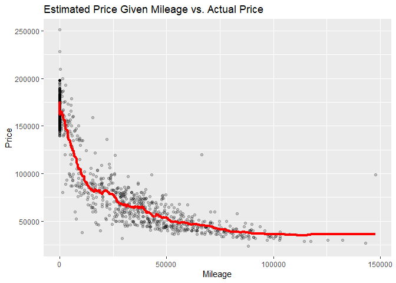

# Question 1

## 1) Data Visualization: Flights at ABIA

Focusing on departures out of Austin, these figures provide insights
into arrival delays and cancellation rate by airline. I chose to focus
on arrival delays specifically because I consider this the superior
measure of passenger experience, given that departure delays can often
be made up for (at least in part) in the air.

After defining a new variable for a “Signficant Disruption” that
represents a flight that is either cancelled or delayed by 2+ hours,
this visualization shows the Significant Disruption Rate by carrier for
flights out of AUS.

# Question 2

## 2A) 95th Percentile of Heights for Female Athletics Competitors

    ## The 95th percentile of heights for female competitors in Athletics events is: 183 centimeters

## 2B) Women’s events with the greatest variability in competitor’s heights across the entire history of the Olympics, as measured by the standard deviation?

    ## # A tibble: 1 × 2
    ##   event                      sd_height
    ##   <chr>                          <dbl>
    ## 1 Rowing Women's Coxed Fours      10.9

## 2C) Average Age of Olympic Swimmers Over Time

    ## The plot illustrates how the average age of Olympic swimmers has changed over time, stratified by gender.

# Question 3

## 350 Trim

To predict the price of a car with a 350 trim given its mileage using
K-nearest neighbors, we first used K-fold cross validation to determine
the K with the lowest average RMSE.

    ## As can be seen above, the K with the lowest average RMSE in this model is 15 . As this is the most optimal RMSE, we will then use it to model price given mileage.

At this value of K, the model predicts the following prices of cars with
a 350 trim given their mileage:

    ## Warning: Using `size` aesthetic for lines was deprecated in ggplot2 3.4.0.
    ## ℹ Please use `linewidth` instead.
    ## This warning is displayed once every 8 hours.
    ## Call `lifecycle::last_lifecycle_warnings()` to see where this warning was
    ## generated.

## AMG Trim

We can repeat this process for the AMG trim.

    ## In this case, the K with the lowest average RMSE in this model is 64 . We will then use it to model price given mileage for cars with an AMG trim.

The estimated price given mileage at that K is:

The AMG trim has the greater optimal value of K compared to the 350
trim. One potential explanation may be that there are more cars with an
AMG trim, 1,413, compared to the 416 cars with a 350 trim. Since the 350
has less datapoints, it would take a relatively lower K to introduce
greater bias into the model when compared to the AMG trim (since a
greater K would ‘cover’ more datapoints). Balancing variance and bias in
an optimal manner would then require choosing a smaller K compared to
AMG, which has a greater amount of datapoints.
